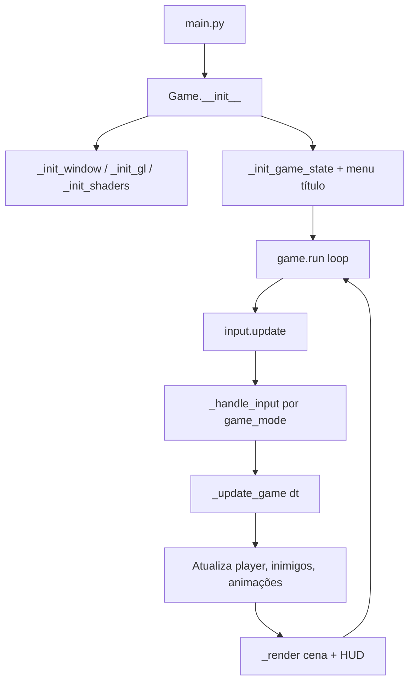
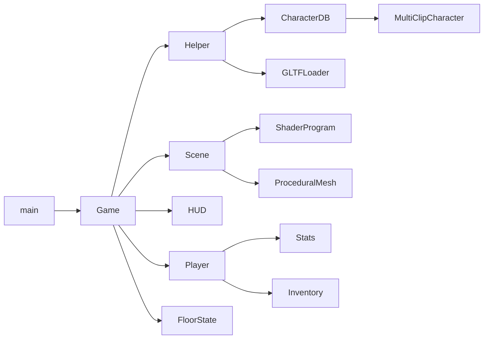

# Arquitetura do projeto

Visão técnica de **Re:Oblivion of Memories**: camadas de código, fluxo de execução, motor 3D e padrões adotados.

[← Voltar ao README principal](../README.md)

---

## Visão em camadas

```
┌─────────────────────────────────────────────────────────┐
│  main.py          Ponto de entrada + patch de input     │
├─────────────────────────────────────────────────────────┤
│  game/            Orquestração: loop, andares, modos    │
│    game_main.py   Classe Game (~4900 linhas)            │
│    combat.py      Combate por turnos (legado/menu)      │
│    floor_state.py Estado mutável por andar              │
│    helper.py      Spawn, save/load, meshes auxiliares   │
├─────────────────────────────────────────────────────────┤
│  entities/        Player, Enemy, Boss, Stats, Inventory │
│  db/              SPELL_DB, ITEM_DB, CHARACTER_DB       │
├─────────────────────────────────────────────────────────┤
│  hud/ + menu.py   UI 2D sobre OpenGL (ortho + quads)    │
├─────────────────────────────────────────────────────────┤
│  engine/          Cena, câmera, shaders, GLTF, física   │
├─────────────────────────────────────────────────────────┤
│  config/          Constantes, paths, caches de mesh     │
│  assets/          GLB, OBJ, shaders, música, SFX        │
└─────────────────────────────────────────────────────────┘
```

A classe `Game` concentra a maior parte da lógica: construção de andares, combate em tempo real, minigames e cutscenes. Módulos menores encapsulam dados (`db/`), entidades (`entities/`) e renderização (`engine/`).

---

## Fluxo de execução



### Modos de jogo (`game_mode`)

| Modo | Responsabilidade |
|------|------------------|
| `menu` | Menus empilhados (`MenuManager`) |
| `explore` | Movimento 3D, combate real-time, interações |
| `story` | Cutscenes com imagens/texto |
| `book` | Leitura dos relatórios de Marluxia |
| `rhythm` | Minigame de setas |
| `death` | Tela de morte + respawn |
| `fade` | Transição entre cenas |
| `credits` | Créditos finais |

O loop principal alterna entre processar input, atualizar estado e desenhar conforme o modo ativo.

---

## Ponto de entrada

`main.py` faz três coisas:

1. Cria `Game()`
2. Substitui parcialmente `InputManager.update` para garantir `mouse_clicked` em menus
3. Chama `game.run()`

Toda a lógica pesada permanece em `src/game/game_main.py`.

---

## Configuração e paths

| Arquivo | Função |
|---------|--------|
| `src/here.py` | `_HERE` = diretório absoluto de `src/` |
| `src/config/paths.py` | Caminhos para GLBs, shaders, save |
| `src/config/constants.py` | Dimensões da sala, offsets de personagens, nomes de clipes |
| `src/config/cache.py` | Caches globais de skinned meshes (Emilia, Beatrice, etc.) |

Assets são resolvidos sempre a partir de `_HERE`, permitindo executar o jogo de qualquer diretório de trabalho desde que `main.py` seja o entry point.

---

## Motor 3D (`src/engine/`)

### Renderização

- **Shaders** em `src/assets/shaders/`:
  - `phong.vert` + `phong.frag` — iluminação Phong para meshes estáticos
  - `skinned.vert` + `phong.frag` — personagens com skeleton animation
  - `unlit.vert` + `unlit.frag` — HUD e elementos sem iluminação

- **`ShaderProgram`** — compila, linka e expõe uniforms (`set_mat4`, `set_vec3`, etc.)

- **`Scene` + `SceneNode`** — grafo plano de nós com posição, rotação Euler, escala, mesh e textura opcional

- **`PointLight`** — luz pontual única por cena, com órbita opcional

### Geometria

| Módulo | Papel |
|--------|-------|
| `mesh.py` | `ProceduralMesh`, primitivas (`make_cube`, `make_plane`, `make_sphere`) |
| `obj_loader.py` | Fallback para modelos `.obj` |
| `gltf_loader.py` | Pipeline principal para `.glb` |
| `skinned_mesh.py` | Mesh com pesos de ossos + VAO |
| `animation.py` | `AnimationController` — troca e interpola clipes |

### Câmera e input

- **`camera.py`** — câmera em terceira pessoa; `flat_forward` / `flat_right` para movimento relativo à câmera
- **`input_manager.py`** — wrapper fino sobre eventos Pygame (teclado, mouse, scroll, resize)

### Colisão

- **`obstacle.py`** — `BoxHitbox`, `CircleHitbox`, `Hitbox` para push-out e triggers
- Colisão player ↔ obstáculos e paredes da sala em `game_main._resolve_player_collision`

---

## Personagens e animação

### `Character` vs `MultiClipCharacter`

Definidos em `src/entities/character.py` e registrados em `src/db/character.py`:

- **`Character`** — um GLB com múltiplos clipes mapeados por nome (`BEATRICE_CLIP_NAMES`, etc.)
- **`MultiClipCharacter`** — vários GLBs (um clipe por arquivo), padrão Mixamo; usado por Subaru, Emilia, Heartless, AerialKnocker e Marluxia

`Helper.load_skinned_*` instancia personagens, aplica `target_height` (auto-scale) e retorna `(SceneNode, SkinnedMesh, AnimationController)`.

### Cache

Meshes pesados são cacheados em `src/config/cache.py` para evitar recarregar GLBs a cada spawn (Beatrice, Emilia, Marluxia, Heartless, AerialKnocker).

---

## Entidades e dados

### `entities/`

| Classe | Descrição |
|--------|-----------|
| `Stats` | HP, MP, ATK, DEF, SPD, XP, level-up |
| `Player` | Stats + inventário + física (pulo, roll, combo) |
| `Enemy` | IA básica, aggro, ataques light/heavy, parry |
| `MarluxiaBoss` | Fases, taunt, curse, invencibilidade, buracos negros |
| `Inventory` | Itens consumíveis e equipamentos |
| `Spell` / `Item` | Dataclasses de gameplay |

### `db/`

Bancos estáticos em memória — não há banco SQL:

- `spell.py` — Shamac, Minya, Invisible Providence, EMT
- `item.py` — poções, agasalho, espada
- `character.py` — `CHARACTER_DB` com paths e parâmetros de escala

---

## Lógica de jogo (`src/game/`)

### `Game` — andares

Constantes de andar em `Game`:

```python
FLOOR_ENTRY    = 0   # Entrada + tutorial
FLOOR_PUZZLE   = 1   # Puzzle + parkour
FLOOR_AERIAL   = 2   # Heartless voadores
FLOOR_RHYTHM   = 3   # Minigame rítmico
FLOOR_GAUNTLET = 4   # Ondas de combate
FLOOR_REST     = 5   # Descanso + lore
FLOOR_BOSS     = 6   # Marluxia
```

`_build_floor(idx)` despacha para `_build_floor_*`, que monta geometria, inimigos, triggers e música.

### `FloorState`

Estado mutável por andar (não global):

- Listas de inimigos `(Enemy, SceneNode)`
- Barreira, escadas, puzzle, caixa empurrável, boss, gauntlet waves
- Flags: `puzzle_solved`, `rhythm_done`, `in_parkour_room`, etc.

### `Helper`

Serviços compartilhados:

- Spawn de Heartless / AerialKnocker
- Construção de escadas e decoração da torre
- `save_game` / `load_game` / `reset_game` → JSON em `src/savegame.json`
- Factories de meshes (`make_box_mesh`, `_add_tower_deco`)

### Combate

Dois sistemas coexistem:

1. **Tempo real** (principal) — `_player_melee_attack`, magias, parry, IA de inimigos no `explore`
2. **`CombatSystem`** (`combat.py`) — turnos clássicos RPG (ataque, magia, item, fugir); legado ou menus específicos

---

## Interface (`hud/` + `menu.py`)

- **HUD** desenha barras de HP/MP, popups, menus de magia/item/skill com quads OpenGL e texturas de texto geradas via Pillow
- **MenuManager** empilha menus (`push`/`pop`); navegação ↑↓ + Enter; integrado ao mesmo HUD

Paleta visual medieval definida em `hud.py` (pergaminho, ouro, safira, carmesim).

---

## Áudio

- **`Effects`** (`engine/sound_effects.py`) — SFX do Subaru, inimigos, parry, etc.
- **`pygame.mixer.music`** — trilhas por andar (`menu.mp3`, `tower.mp3`, `combat.mp3`, `puzzle.mp3`, `boss.mp3`, `rythm.mp3`)

---

## Diagrama de dependências principais



---

## Convenções de código

- Paths de assets sempre via `src/config/paths.py` e `_HERE`
- Nomes de clipes de animação mapeados em `constants.py` (`HEARTLESS_CLIP_NAMES`, `MARLUXIA_CLIP_NAMES`, …)
- Destruição explícita de `SkinnedMesh` em `_clear_scene()` para liberar VAO/VBO OpenGL
- Comentários em português no código de gameplay; identificadores em inglês

---

## Extensibilidade

| Para adicionar… | Onde alterar |
|-----------------|--------------|
| Novo andar | Constante `FLOOR_*`, builder `_build_floor_*`, lógica em `_interact` / `_update_game` |
| Novo inimigo | `entities/enemy.py`, spawn em `helper.py`, GLB em `assets/models/` |
| Nova magia | `entities/spell.py` + `db/spell.py` + handler `_cast_spell` |
| Novo personagem jogável | `db/character.py`, clips em `paths.py`, loader no `Helper` |

---

## Limitações conhecidas

- `game_main.py` é monolítico — facilita prototipagem, dificulta testes unitários isolados
- Colisão simplificada (AABB / círculos), sem motor de física externo
- Save não persiste estado de puzzle/ondas parcialmente completas — apenas andar e stats do player
- `Enemy.update` está duplicado no arquivo `enemy.py` (segunda definição sobrescreve a primeira)

---

## Leitura complementar

- [Como rodar](COMO-RODAR.md)
- [Gameplay e conteúdo](JOGO.md)
- [Controles](CONTROLES.md)
